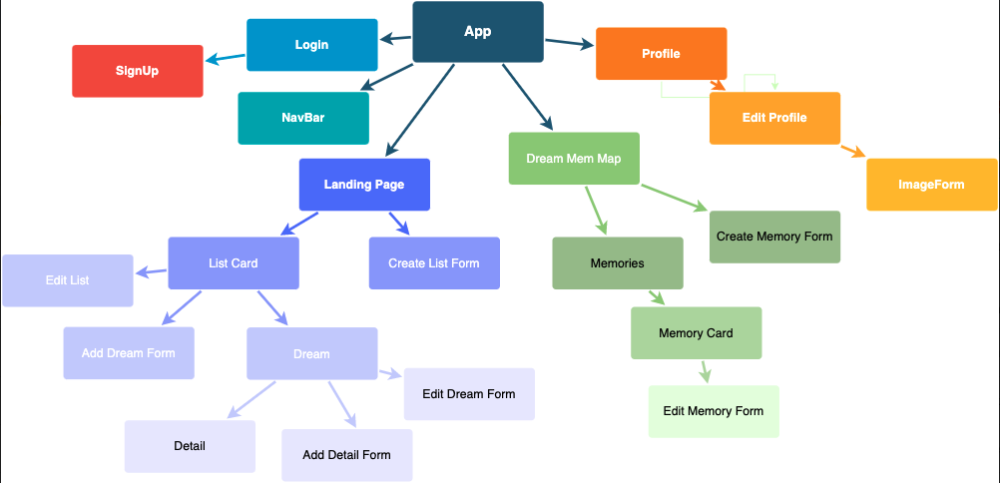
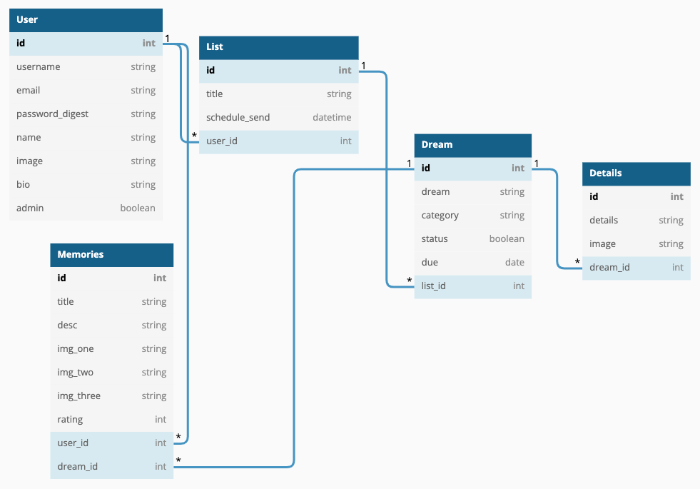
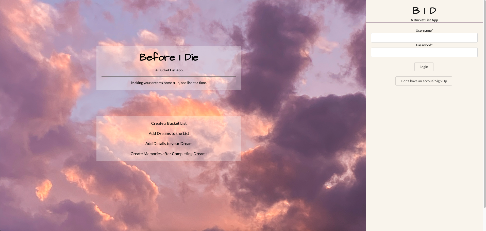
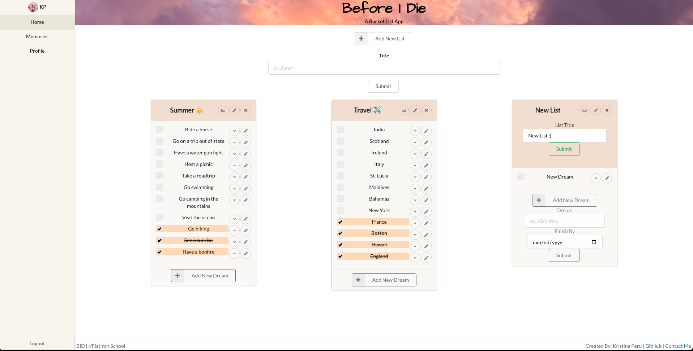
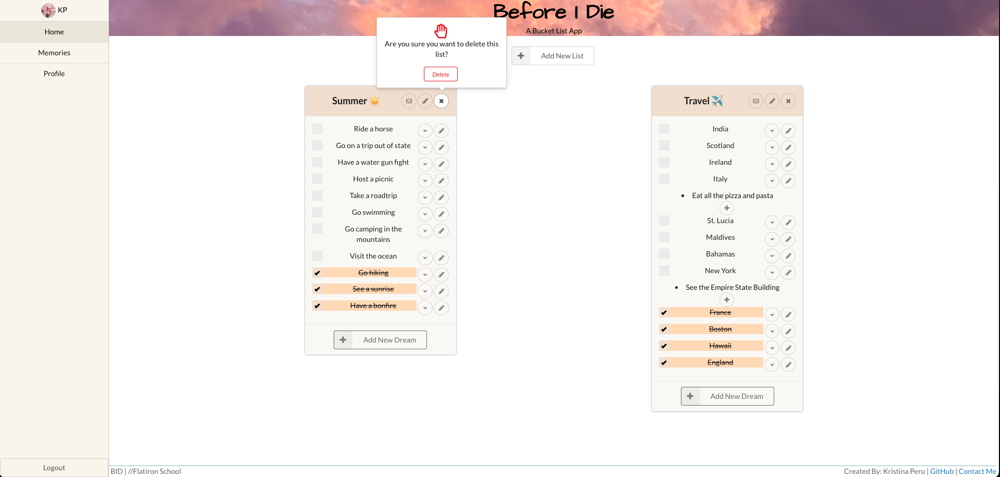
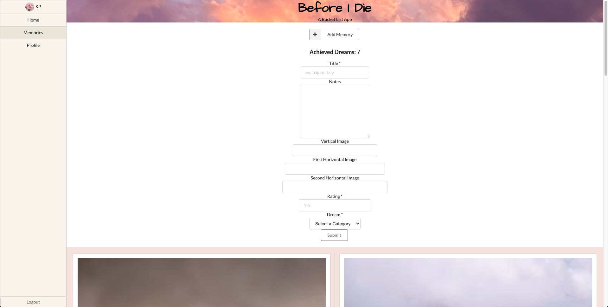
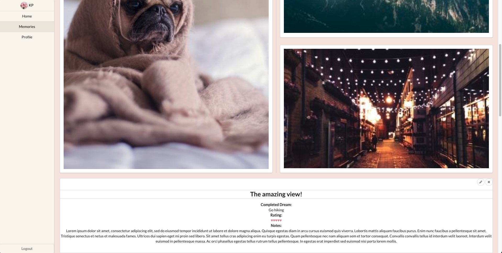
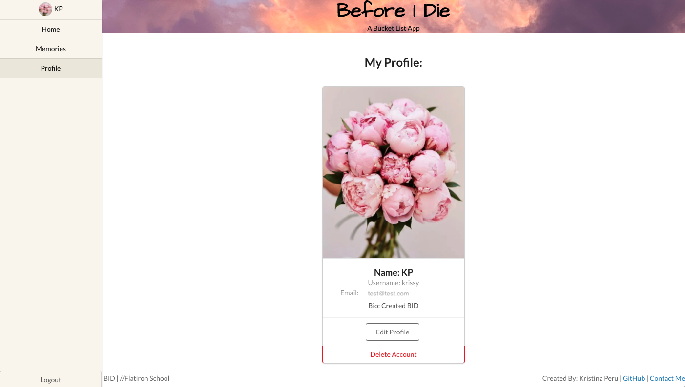

# Before I Die

[Before I Die App](https://beforeidieapp.herokuapp.com/)

A Bucket List App. Making your dreams come true, one list at a time.

## User Stories

* A user will be able to signup and login.
* Create bucket lists.
  * Email themselves a list.
  * Update and delete list.
* Add dreams to the bucket list.
  * Edit dreams.
  * Mark dreams as complete
* Add details to the dreams.
* Create memories associated with completed dreams.
  * Update and delete memories.
* Edit your profile.
  * Upload a new profile picture.

# Setup

## Front End

The front-end of the website is built using React.
`npm start --prefix client` runs the app in the development mode.
Open [http://localhost:4000](http://localhost:4000) to view it in the browser.

## Back End

The back-end of the website is built using Ruby on Rails.
`rails db:create db:migrate db:seed` then run `rails s` to run the back-end of the app in the development mode.
Open [http://localhost:3000](http://localhost:3000) to view it in the browser.

# Demo

## Login Page

## Home Page

## Memories Page

## Profile

## What I Used

* Ruby on Rails
  * Action Mailer
* React
* Cloudinary
* Semantic UI

## Author

Kristina Peru | [GitHub](https://github.com/krisperu) | [LinkedIn](https://www.linkedin.com/in/kristina-peru-205557189/)
